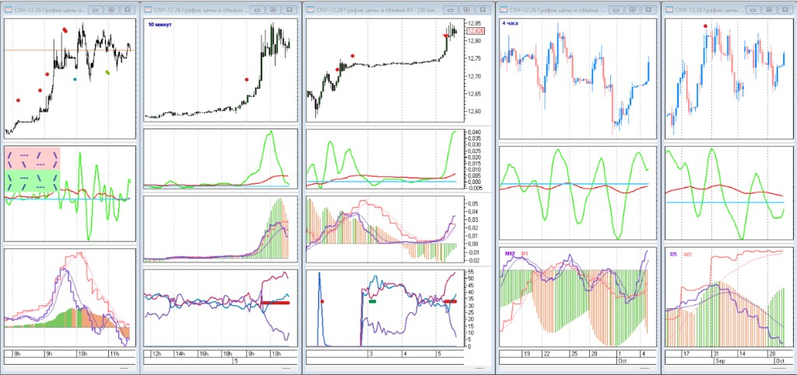

# ScrQuik



Рабочее место в QUIK по **одному инструменту на нескольких ТФ**: M1, M10, M30, H4, D1. На каждом графике одни и те же линии RPM (current и up). Скрин выше — эта раскладка.

Репозиторий появился потому, что живой QLua считает только то, что уже открыто на графике. Чтобы разобрать историю, сравнить похожие пачки, нарисовать метки и сеть, нужны **те же числа офлайн**, с той же раскладкой, что на экране. Иначе Python и QUIK расходятся.

**Что здесь:**

- индикаторы QLua для QUIK (RPM, метки сетапов, сеть);
- Python-анализатор тех же линий по CSV [barsSaver](docs/barsSaver.md);
- оверлеи обратно на график: `*AnalyzerMarks`, `*AnalyzerNet`.

Рабочий ряд — **M1**. Старшие ТФ собирают из него; CSV M10/M30/H4/D1 — сверка на закрытии. Сигналы на истории считают каждую минуту, как live; на открытом слоте они моргают ([docs/tf-from-m1.md](docs/tf-from-m1.md)). Движение смотрят парными связками соседних ТФ (D1–H4, H4–M30, M30–M10), не одним графиком и не всеми сразу. Это не торговый робот и не смена правил сетапов комбо.

Дальше — состав папок, установка Lua и команды анализатора. Оглавление: [docs/README.md](docs/README.md).

## Состав репозитория

```
lua/                 индикаторы QLua (копировать в QUIK)
lua/archive/         старые версии RPM-up
config/              ini RPM-up
analyzer/            Python-пакет (снимок, сетапы, метки, сеть)
tests/               unittest
docs/                документация
```

## Требования

- QUIK с QLua
- Python 3.10+ (`numpy` нужен для `--train-net` / `--net` / `--watch-net`)
- скрипт [barsSaver](https://github.com/nick-nh/qlua/tree/master/barsSaver) (nick-nh) в QUIK (`C:\QuikFinam\LuaScripts\barsSaver\`); наша установка и `sec_list`: [docs/barsSaver.md](docs/barsSaver.md)

Для `--train-net` / `--net` / `--watch-net` нужен `numpy` (см. `pyproject.toml`). Остальной анализатор стандартной библиотеки достаточно.

## Установка индикаторов

Скопировать в `C:\QuikFinam\LuaIndicators\`:

| файл | зачем |
|---|---|
| `lua/maLib.lua` | библиотека TF / EMA |
| `lua/RPM_TF_Current.lua` | RPM текущего ТФ |
| `lua/RPM_TF_Up_5.lua` | RPM старших ТФ + гистограмма + дивер |
| `lua/AnalyzerMarks.lua` | точки сетапов на цене |
| `lua/AnalyzerNet.lua` | `*AnalyzerNet`: флет режима, три пунктира среднего ahead, точки M10/M30 на 33 |

После замены lua снять индикатор с графика и навесить снова.

Настройки RPM-up в репозитории: [`config/RPM_TF_Up_5.ini`](config/RPM_TF_Up_5.ini) (секция по ТФ **графика**, не по инструменту). На живом графике QUIK хранит свои значения в `finam.wnd`.

## Раскладка на графике

На M1, M10, M30, H4, D1:

- один `*RPM_TF_Current`
- один `*RPM_TF_Up_5`

`*AnalyzerMarks` — M1, M10, M30, H4 и D1, на ценовой панели. `*AnalyzerNet` — M1, M10, M30, H4 и D1, **отдельное окно** (не на цену); точки `buy_in`/`sell_in` на уровне 33 только на M10 и M30.

Слои RPM-up (Small / Middle / Up):

| график | Small | Middle | Up (hist на M1/M30/H4/D1) |
|---|---|---|---|
| M1 | Mn5 | Mn10 | Mn20 |
| M10 | Mn20 (hist) | Mn30 | H2 |
| M30 | H1 | H2 | H4 |
| H4 | H12 | D1 | W1 |
| D1 | D5 | W2 | W5 |

D2–D5 и W2–W5 в анализаторе режутся так же, как Lua (unix-дни), чтобы гистограмма D1 совпадала с графиком.

## Анализатор

Считает те же RPM и сетапы `buy` / `sell` / `buy1` / `sell1` / `buy2` / `sell2` по ряду из M1 и пишет метки для `*AnalyzerMarks`. `--pack-ahead` ищет похожую пачку формирующегося D1 на D1/H4/M30 и смотрит закрытие следующего D1 справа (без цепочки). `--train-net` / `--net` — нейронка по парным связкам, общие веса на одну связку: три головы ahead (10 / 30 / 240 M1), головы действия нет; точка на M10/M30 — среднее трёх вероятностей и порог. Как считают круг: [docs/analyzer-net.md](docs/analyzer-net.md#точка-обучение-и-живой-график). Сетапы меток не меняет.

Все команды с описанием: [docs/cli.md](docs/cli.md).

`--watch` не закрывать: простой **11 с**, пачка грязных тикеров до **21 с**, сначала M1, потом M10, M30, H4, D1.

Нейронка по парным связкам (общие веса): [docs/analyzer-net.md](docs/analyzer-net.md) (`--train-net`, `--watch-net`, `*AnalyzerNet`; [как ставят точку](docs/analyzer-net.md#точка-обучение-и-живой-график)).
Подробности меток и сетапов: [docs/analyzer-marks.md](docs/analyzer-marks.md).
Теги, пачки, парные связки (D1–H4, H4–M30, M30–M10), цепочки и похожесть по числам живого графика: [docs/tag-packs.md](docs/tag-packs.md).
Архитектура Python: [docs/python-analyzer.md](docs/python-analyzer.md).
Команды: [docs/cli.md](docs/cli.md).
barsSaver: [docs/barsSaver.md](docs/barsSaver.md).

## Тесты

```text
python -m unittest discover -s tests -t . -v
```

Часть тестов читает живые CSV `barsSaver` (GAZP). Если файлов нет, эти кейсы пропускаются.

## Документация

- [docs/README.md](docs/README.md) — оглавление
- [docs/cli.md](docs/cli.md) — все команды анализатора
- [docs/barsSaver.md](docs/barsSaver.md) — установка barsSaver и отличия от апстрима
- [docs/rpm-tf-up-5/](docs/rpm-tf-up-5/) — дивергенции RPM-up v5
- [lua/README.md](lua/README.md) — что копировать в QUIK
