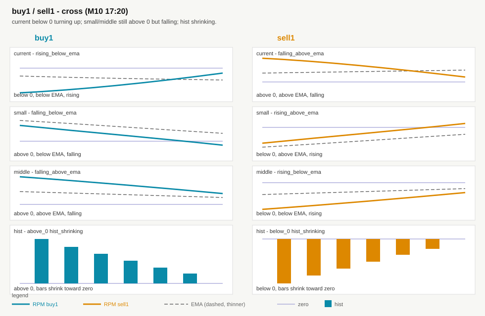
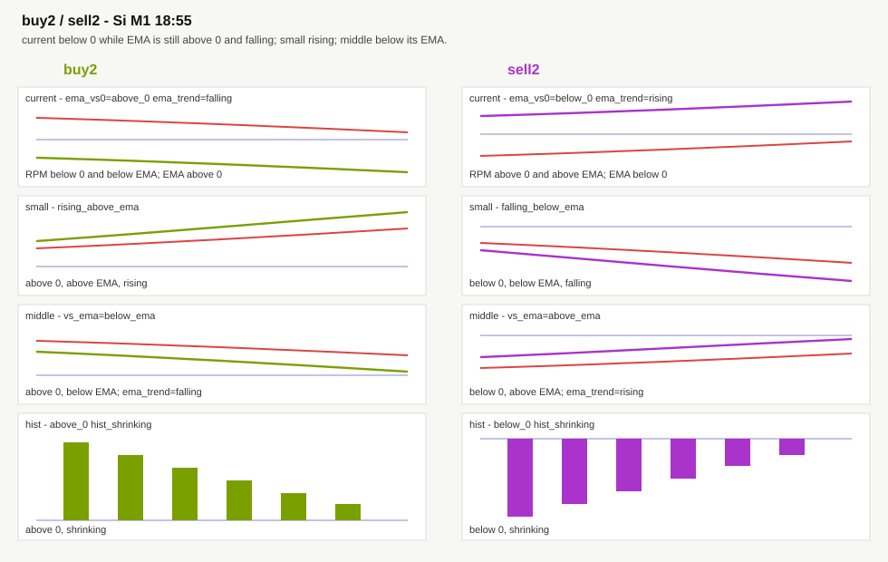

# Метки анализатора на графике QUIK

Анализатор считает сетапы `buy` / `sell` / `buy1` / `sell1` / `buy2` / `sell2` по CSV свечей.
Индикатор `*AnalyzerMarks` только рисует эти сетапы точками на цене.
Сами RPM на графике по-прежнему считает Lua (current / up / 121).

Исходник оверлея: [`lua/AnalyzerMarks.lua`](../lua/AnalyzerMarks.lua).

## Что должно быть запущено

Нужны **три** процесса. Без любого из них картинка не живая.

| # | Что | Зачем |
|---|---|---|
| 1 | QUIK + скрипт **[barsSaver](https://github.com/nick-nh/qlua/tree/master/barsSaver)** | пишет свечи |
| 2 | `python -m analyzer --watch` из корня репозитория | считает сетапы и пишет метки |
| 3 | индикатор **\*AnalyzerMarks** на ценовой панели M1 или M10 | рисует точки |

M30 и H4 анализатор для меток **не считает**. На этих ТФ индикатор ничего не рисует.

## Запуск

### 1. Свечи

В QUIK запустите Lua-скрипт [barsSaver](https://github.com/nick-nh/qlua/tree/master/barsSaver) (`C:\QuikFinam\LuaScripts\barsSaver\`). Описание автора: [nick-nh.github.io](https://nick-nh.github.io/2021-11-24/barsSaver-post). Наша установка, `sec_list` и параметры: [barsSaver.md](barsSaver.md).
Список инструментов: `sec_list.txt`. Для каждого тикера нужны интервалы 1, 10, 30, 240.

Файлы свечей:

`C:\QuikFinam\LuaScripts\barsSaver\data\{SEC}_{CLASS}_{ТФ}_.csv`

Примеры: `GAZP_TQBR_M10_.csv`, `CR_SPBFUT_M1_.csv`.

barsSaver дописывает строку, когда у бара **новое время** (закрылась предыдущая свеча). Тики текущей свечи в файл не попадают.

После правки `sec_list.txt` скрипт нужно **перезапустить**. Если M1 одного тикера перестал расти, а M10 того же тикера пишется — перезапустить barsSaver (обрыв datasource после disconnect QUIK).

### 2. Анализатор

Из корня репозитория:

```text
python -m analyzer --watch
```

Окно не закрывать. Каждые **11 секунд** в консоли строка `poll#… n=… dirty=… M1=… M10=…`. Если `dirty=0` — свечи не выросли, пересчёта нет, это не зависание. Ctrl+C останавливает.

Сначала считаются все грязные **M1**, потом **M10**. Грязная пачка занимает до **21 с**; если не влезли — строка `defer … next poll`. Для меток считаются последние ~6 тыс. баров M1 и ~2 тыс. M10, не вся история CSV. После короткого цикла пауза — остаток до 11 с, а не ещё 11 с сверху.

Другие варианты:

```text
python -m analyzer --watch --sec GAZP
python -m analyzer --marks
python -m analyzer --sec GAZP --marks
python -m analyzer --sec CNY12.26 --watch
```

`--marks` без `--watch` — разовая выгрузка и выход.
`--sec` не указан — все инструменты из папки data (TQBR и SPBFUT).
Класс по умолчанию TQBR; для имени на `CNY*` — SPBFUT.

Код: пакет `analyzer/`.

### 3. Индикатор на графике

Скопировать `lua/AnalyzerMarks.lua` в:

`C:\QuikFinam\LuaIndicators\AnalyzerMarks.lua`

На графике **M1** или **M10**:

1. Добавить индикатор `*AnalyzerMarks`.
2. Поставить его **на ценовую панель** (не в отдельное окно).
3. После обновления lua — снять и навесить заново или пересчитать.

Настройки:

- `OnsetOnly = 1` — точка только на первом баре серии (так и нужно).
- `ReloadSec = 15` — как часто смотреть, изменился ли CSV. Полная перерисовка только если файл реально обновился.
- `MarksDir` пустой — папка `LuaIndicators\analyzer_marks`.

## Куда пишутся метки

`C:\QuikFinam\LuaIndicators\analyzer_marks\{SEC}_{CLASS}_{ТФ}.csv`

Только M1 и M10. Пример: `GAZP_TQBR_M10.csv`.

Индикатор берёт `sec_code` и ТФ из окна графика и открывает соответствующий файл.

## Что видно на графике

| точка | сетап | где |
|---|---|---|
| зелёная | buy | под low |
| красная | sell | над high |
| голубая | buy1 | под low |
| оранжевая | sell1 | над high |
| жёлто-зелёная | buy2 | под low |
| сиреневая | sell2 | над high |

Порядок проверки: buy, sell, buy1, sell1, buy2, sell2, иначе `none`. Тег, которого нет в таблице сетапа, **не проверяется** (любое значение подходит).

### Словарь тегов

| тег | где | описание |
|---|---|---|
| `vs0` | current, small, middle | RPM относительно нуля |
| `vs_ema` | current, small, middle | RPM относительно своей EMA |
| `slope` | current, small, middle | шаг RPM за 1 бар + сторона EMA |
| `ema_vs0` | current, small, middle | EMA относительно нуля |
| `ema_slope` | current, small, middle | шаг EMA за 1 бар |
| `ema_trend` | current, small, middle | наклон EMA за 5 баров (не путать с `ema_slope`) |
| `hist_sign` | hist | гистограмма относительно нуля |
| `hist_dir` | hist | столбик удлиняется от нуля или сжимается к нулю |

| значение | описание |
|---|---|
| `below_0` | заметно ниже нуля |
| `above_0` | заметно выше нуля |
| `near_0` | у нуля (модуль меньше 0.25 медианы ряда) |
| `below_ema` | RPM ниже своей EMA |
| `above_ema` | RPM выше своей EMA |
| `near_ema` | у EMA (разница меньше 0.15 медианы) |
| `falling` | вниз |
| `rising` | вверх |
| `flat` | шаг меньше 0.08 медианы |
| `rising_below_ema` | RPM растёт и ниже EMA |
| `rising_above_ema` | RPM растёт и выше EMA |
| `falling_below_ema` | RPM падает и ниже EMA |
| `falling_above_ema` | RPM падает и выше EMA |
| `hist_growing` | столбик удлиняется от нуля (вниз если hist &lt; 0, вверх если hist &gt; 0) |
| `hist_shrinking` | столбик короче, к нулю |

Пороги: `NEAR_ZERO=0.25`, `NEAR_EMA=0.15`, `NEAR_SLOPE=0.08`, `NEAR_HIST=0.15`, тренд EMA — 5 баров.

### buy / sell


| слой | тег | buy | sell | словами |
|---|---|---|---|---|
| small | `vs0` | `below_0` | `above_0` | RPM small ниже / выше нуля |
| small | `vs_ema` | `below_ema` | `above_ema` | RPM small ниже / выше своей EMA |
| small | `ema_vs0` | `below_0` | `above_0` | EMA small ниже / выше нуля |
| small | `ema_trend` | `falling` | `rising` | EMA small падает / растёт 5 баров |
| middle | `vs0` | `below_0` | `above_0` | RPM middle ниже / выше нуля |
| middle | `vs_ema` | `below_ema` | `above_ema` | RPM middle ниже / выше своей EMA |
| middle | `ema_vs0` | `below_0` | `above_0` | EMA middle ниже / выше нуля |
| middle | `ema_trend` | `falling` | `rising` | EMA middle падает / растёт 5 баров |
| current | `vs0` | `below_0` | `above_0` | RPM current ниже / выше нуля |
| current | `vs_ema` | `below_ema` | `above_ema` | RPM current ниже / выше своей EMA |
| current | `ema_vs0` | `below_0` | `above_0` | EMA current ниже / выше нуля |
| hist | `hist_sign` | `below_0` | `above_0` | гистограмма ниже / выше нуля |
| hist | `hist_dir` | `hist_growing` | `hist_growing` | столбик удлиняется от нуля |

Наклон самих small/middle (`slope`) в классическом стеке не входит.

### buy1 / sell1

Кросс как M10 25.08.2026 17:20.



| слой | тег | buy1 | sell1 | словами |
|---|---|---|---|---|
| current | `vs0` | `below_0` | `above_0` | current уже ниже / выше нуля |
| current | `vs_ema` | `below_ema` | `above_ema` | current ниже / выше своей EMA |
| current | `slope` | `rising_below_ema` | `falling_above_ema` | current разворачивается вверх снизу / вниз сверху |
| small | `vs0` | `above_0` | `below_0` | small ещё выше / ниже нуля |
| small | `vs_ema` | `below_ema` | `above_ema` | small уже ниже / выше своей EMA |
| small | `slope` | `falling_below_ema` | `rising_above_ema` | small падает под EMA / растёт над EMA |
| small | `ema_vs0` | `above_0` | `below_0` | EMA small ещё выше / ниже нуля |
| small | `ema_slope` | `falling` | `rising` | EMA small падает / растёт (1 бар) |
| middle | `vs0` | `above_0` | `below_0` | middle ещё выше / ниже нуля |
| middle | `vs_ema` | `above_ema` | `below_ema` | middle ещё выше / ниже своей EMA |
| middle | `slope` | `falling_above_ema` | `rising_below_ema` | middle падает над EMA / растёт под EMA |
| middle | `ema_vs0` | `above_0` | `below_0` | EMA middle ещё выше / ниже нуля |
| middle | `ema_slope` | `falling` | `rising` | EMA middle падает / растёт (1 бар) |
| hist | `hist_sign` | `above_0` | `below_0` | hist ещё выше / ниже нуля |
| hist | `hist_dir` | `hist_shrinking` | `hist_shrinking` | столбик сжимается к нулю |

### buy2 / sell2

Как Si M1 22.09.2026 18:55. Наклон middle и 1-бар current не входят.



| слой | тег | buy2 | sell2 | словами |
|---|---|---|---|---|
| current | `vs0` | `below_0` | `above_0` | current ниже / выше нуля |
| current | `vs_ema` | `below_ema` | `above_ema` | current ниже / выше своей EMA |
| current | `ema_vs0` | `above_0` | `below_0` | EMA current ещё выше / уже ниже нуля |
| current | `ema_trend` | `falling` | `rising` | EMA current падает / растёт 5 баров |
| small | `vs0` | `above_0` | `below_0` | small выше / ниже нуля |
| small | `vs_ema` | `above_ema` | `below_ema` | small выше / ниже своей EMA |
| small | `ema_vs0` | `above_0` | `below_0` | EMA small выше / ниже нуля |
| small | `ema_trend` | `rising` | `falling` | EMA small растёт / падает 5 баров |
| small | `slope` | `rising_above_ema` | `falling_below_ema` | small растёт над EMA / падает под EMA |
| middle | `vs0` | `above_0` | `below_0` | middle выше / ниже нуля |
| middle | `vs_ema` | `below_ema` | `above_ema` | middle **ниже** своей EMA / **выше** своей EMA |
| middle | `ema_vs0` | `above_0` | `below_0` | EMA middle выше / ниже нуля |
| middle | `ema_trend` | `falling` | `rising` | EMA middle падает / растёт 5 баров |
| hist | `hist_sign` | `above_0` | `below_0` | hist выше / ниже нуля |
| hist | `hist_dir` | `hist_shrinking` | `hist_shrinking` | столбик сжимается к нулю |

## Задержка

Новый бар в barsSaver → до 11 с простоя до следующего poll Python → очередь тикеров (до 21 с на пачку) → до 15 с до точек на графике.
Плюс формирующаяся свеча в CSV ещё не попала: на M1 это около минуты.
Если barsSaver не дописал M1, метки на этом ТФ стоят на последнем сохранённом баре, даже если график QUIK уже ушёл вперёд.

## Как добавить инструмент

1. В `C:\QuikFinam\LuaScripts\barsSaver\sec_list.txt` добавить **четыре** строки: interval 1, 10, 30, 240.
2. `sec_code` и `class_code` взять **как в QUIK** (CreateDataSource). Длинные имена фьючерсов часто не работают.
3. Перезапустить barsSaver, дождаться файлов в `data\`.
4. `--watch` подхватит новый тикер сам, когда появятся M1 и M10.

Пример акций:

```text
{ sec_code = "SBER", class_code = "TQBR", interval = 1 },
```

Фьючерс CNY декабрь 2026 в QUIK — это **CRZ6** / SPBFUT, файлы `CR_SPBFUT_*.csv`.
Имя `CNY12.26` в barsSaver даёт `unknown sec code`. На графике CNY12.26 индикатор всё равно читает файл `CR`.

## Если точек нет

- Запущен ли barsSaver, есть ли свежий CSV в `data\` **на тот же ТФ**, что график.
- Запущен ли `python -m analyzer --watch`, пишет ли он строки в консоль (`poll=11s budget=21s`).
- Есть ли файл меток в `analyzer_marks` на тот же тикер и ТФ, что график, и не обрывается ли он раньше последней свечи.
- Индикатор навешен на **цену** M1/M10, lua скопирован из `lua/AnalyzerMarks.lua` в `LuaIndicators`.
- Для фьючерса в `sec_list` короткий код (`CRZ6`, не `CNY12.26`).
