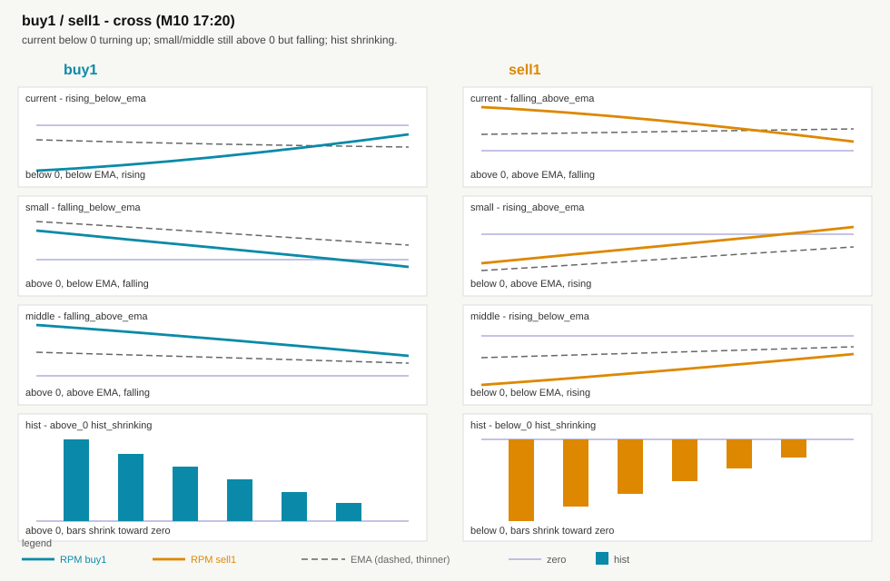
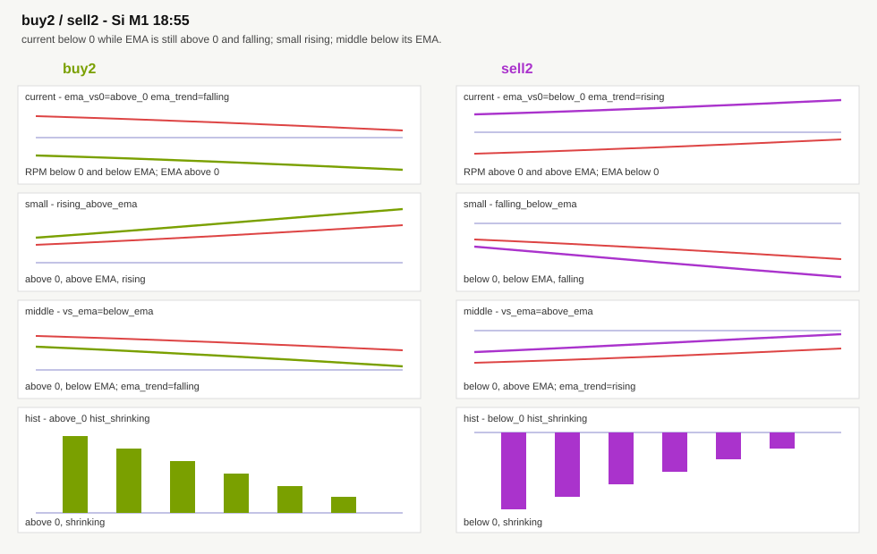

# Метки анализатора на графике QUIK

Анализатор считает сетапы `buy` / `sell` / `buy1` / `sell1` / `buy2` / `sell2` по CSV свечей.
Индикатор `*AnalyzerMarks` только рисует эти сетапы точками на цене.
Сами RPM на графике по-прежнему считает Lua (current / up / 121).

Исходник оверлея: [`lua/AnalyzerMarks.lua`](../lua/AnalyzerMarks.lua).

## Что должно быть запущено

Нужны **три** процесса. Без любого из них картинка не живая.

| # | Что | Зачем |
|---|---|---|
| 1 | QUIK + скрипт **[barsSaver](https://github.com/nick-nh/qlua/tree/master/barsSaver)** | пишет свечи |
| 2 | `python -m analyzer --watch` из корня репозитория | считает сетапы и пишет метки |
| 3 | индикатор **\*AnalyzerMarks** на ценовой панели M1, M10, M30, H4 или D1 | рисует точки |

## Запуск

### 1. Свечи

В QUIK запустите Lua-скрипт [barsSaver](https://github.com/nick-nh/qlua/tree/master/barsSaver) (`C:\QuikFinam\LuaScripts\barsSaver\`). Описание автора: [nick-nh.github.io](https://nick-nh.github.io/2021-11-24/barsSaver-post). Наша установка, `sec_list` и параметры: [barsSaver.md](barsSaver.md).
Список инструментов: `sec_list.txt`. Для каждого тикера нужны интервалы 1, 10, 30, 240, 1440 (M1 / M10 / M30 / H4 / D1).

Файлы свечей:

`C:\QuikFinam\LuaScripts\barsSaver\data\{SEC}_{CLASS}_{ТФ}_.csv`

Примеры: `GAZP_TQBR_M10_.csv`, `CR_SPBFUT_M1_.csv`.

barsSaver дописывает строку, когда у бара **новое время** (закрылась предыдущая свеча). Тики текущей свечи в файл не попадают.

После правки `sec_list.txt` скрипт нужно **перезапустить**. Если M1 одного тикера перестал расти, а M10 того же тикера пишется — перезапустить barsSaver (обрыв datasource после disconnect QUIK).

### 2. Анализатор

Из корня репозитория:

```text
python -m analyzer --watch
```

Окно не закрывать. Каждые **11 секунд** в консоли строка `poll#… n=… dirty=… M1=… M10=… M30=… H4=… D1=…`. Если `dirty=0` — свечи не выросли, пересчёта нет, это не зависание. Ctrl+C останавливает.

Сначала считаются все грязные **M1**, потом **M10**, потом **M30**, потом **H4**, потом **D1**. Грязная пачка занимает до **21 с**; если не влезли — строка `defer … next poll`. Для меток считаются последние ~6 тыс. баров M1, ~2 тыс. M10/M30/H4 и ~800 D1, не вся история CSV. Пока нет `*_D1_.csv` — D1 пропускается. После короткого цикла пауза — остаток до 11 с, а не ещё 11 с сверху.

Другие варианты:

```text
python -m analyzer --watch --sec GAZP
python -m analyzer --marks
python -m analyzer --sec GAZP --marks
python -m analyzer --sec CNY12.26 --watch
```

`--marks` без `--watch` — разовая выгрузка и выход.
`--sec` не указан — все инструменты из папки data (TQBR и SPBFUT).
Класс по умолчанию TQBR; для имени на `CNY*` — SPBFUT.

Код: пакет `analyzer/`.

### 3. Индикатор на графике

Скопировать `lua/AnalyzerMarks.lua` в:

`C:\QuikFinam\LuaIndicators\AnalyzerMarks.lua`

На графике **M1**, **M10**, **M30**, **H4** или **D1** (на дневке `*AnalyzerMarks` нужно добавить отдельно — в раскладке окна его может не быть):

1. Добавить индикатор `*AnalyzerMarks`.
2. Поставить его **на ценовую панель** (не в отдельное окно).
3. После обновления lua — снять и навесить заново или пересчитать.

Настройки:

- `OnsetOnly = 1` — точка только на первом баре серии (M1/M10/M30/H4). На **D1** продолжение серии тоже рисуется: время дневной свечи в QUIK часто не `00:00`, как в CSV.
- `ReloadSec = 15` — как часто смотреть, изменился ли CSV. Полная перерисовка только если файл реально обновился.
- `MarksDir` пустой — папка `LuaIndicators\analyzer_marks`.

## Куда пишутся метки

`C:\QuikFinam\LuaIndicators\analyzer_marks\{SEC}_{CLASS}_{ТФ}.csv`

M1, M10, M30, H4 и D1. Пример: `GAZP_TQBR_M10.csv`, `GAZP_TQBR_H4.csv`, `CR_SPBFUT_D1.csv`.

Индикатор берёт `sec_code` и ТФ из окна графика и открывает соответствующий файл.

## Что видно на графике

| точка | сетап | где |
|---|---|---|
| зелёная | buy | под low |
| красная | sell | над high |
| голубая | buy1 | под low |
| оранжевая | sell1 | над high |
| жёлто-зелёная | buy2 | под low |
| сиреневая | sell2 | над high |

Порядок проверки: buy, sell, buy1, sell1, buy2, sell2, иначе `none`. Тег, которого нет в таблице сетапа, **не проверяется** (любое значение подходит). Метки только по **закрытому** бару: формирующаяся свеча на графике в расчёт не входит.

Наклон и флет в ячейках: `(/)` рост, `(\)` падение, `(-)` флет.

### Все сетапы

| тег | buy | sell | buy1 | sell1 | buy2 | sell2 |
|---|---|---|---|---|---|---|
| current.vs0 | `below_0` | `above_0` | `below_0` | `above_0` | `below_0` | `above_0` |
| current.vs_ema | `below_ema` | `above_ema` | `below_ema` | `above_ema` | `below_ema` | `above_ema` |
| current.slope | | | `rising_below_ema` `(/)` | `falling_above_ema` `(\)` | | |
| current.ema_vs0 | `below_0` | `above_0` | | | `above_0` | `below_0` |
| current.ema_trend | | | | | `falling` `(\)` | `rising` `(/)` |
| small.vs0 | `below_0` | `above_0` | `above_0` | `below_0` | `above_0` | `below_0` |
| small.vs_ema | `below_ema` | `above_ema` | `below_ema` | `above_ema` | `above_ema` | `below_ema` |
| small.slope | | | `falling_below_ema` `(\)` | `rising_above_ema` `(/)` | `rising_above_ema` `(/)` | `falling_below_ema` `(\)` |
| small.ema_vs0 | `below_0` | `above_0` | `above_0` | `below_0` | `above_0` | `below_0` |
| small.ema_slope | | | `falling` `(\)` | `rising` `(/)` | | |
| small.ema_trend | `falling` `(\)` | `rising` `(/)` | | | `rising` `(/)` | `falling` `(\)` |
| middle.vs0 | `below_0` | `above_0` | `above_0` | `below_0` | `above_0` | `below_0` |
| middle.vs_ema | `below_ema` | `above_ema` | `above_ema` | `below_ema` | `below_ema` | `above_ema` |
| middle.slope | | | `flat_above_ema` `(-)` или `falling_above_ema` `(\)` | `flat_below_ema` `(-)` или `rising_below_ema` `(/)` | | |
| middle.ema_vs0 | `below_0` | `above_0` | `above_0` | `below_0` | `above_0` | `below_0` |
| middle.ema_slope | | | `flat` `(-)` или `falling` `(\)` | `flat` `(-)` или `rising` `(/)` | | |
| middle.ema_trend | `falling` `(\)` | `rising` `(/)` | | | `falling` `(\)` | `rising` `(/)` |
| hist.hist_sign | `below_0` | `above_0` | `above_0` | `below_0` | `above_0` | `below_0` |
| hist.hist_dir | `hist_growing` `(\)` | `hist_growing` `(/)` | `hist_shrinking` `(\)` | `hist_shrinking` `(/)` | `hist_shrinking` `(\)` | `hist_shrinking` `(/)` |

На графике H4 слои up: small = H12, middle = D1, hist = W1.
На дневном графике (D1, из `finam.wnd`): small = D5, middle = W2, hist = W5. Слоты D5/W2/W5 в Python совпадают с Lua (unix-дни, не `toordinal()`), иначе `hist_dir` расходится с цветом столбика на графике.

На живом RPM-up **оранжевый/лососевый** столбик — `histDw` (короче предыдущего), **зелёный** — `histUp` (длиннее). Знак hist при этом может оставаться выше нуля: sell требует `hist_sign=above_0` **и** `hist_dir=hist_growing`, то есть зелёный рост от нуля, не оранжевый.

### Словарь тегов

**Тег** — одно свойство RPM на закрытом баре: слой + поле + значение (`M1.current.vs0 = above_0`). Пачка — ≥5 тегов одного бара одного ТФ; несколько ТФ — связка; соседние бары окна — цепочка; динамика связки по кадрам ведущего ТФ — цепочка связок. Похожесть пачек — по числам живого графика (`z = rpm / median(|rpm|)`), не по готовым меткам; схема: [tag-similarity.svg](images/tag-similarity.svg). Определения: [tag-packs.md](tag-packs.md).

| тег | где | описание |
|---|---|---|
| `vs0` | current, small, middle | RPM относительно нуля |
| `vs_ema` | current, small, middle | RPM относительно своей EMA |
| `slope` | current, small, middle | шаг RPM за 1 бар + сторона EMA |
| `ema_vs0` | current, small, middle | EMA относительно нуля |
| `ema_slope` | current, small, middle | шаг EMA за 1 бар |
| `ema_trend` | current, small, middle | наклон EMA за 5 баров (не путать с `ema_slope`) |
| `hist_sign` | hist | гистограмма относительно нуля |
| `hist_dir` | hist | столбик удлиняется от нуля или сжимается к нулю |

| значение | описание |
|---|---|
| `below_0` | заметно ниже нуля |
| `above_0` | заметно выше нуля |
| `near_0` | у нуля (модуль меньше 0.25 медианы ряда) |
| `below_ema` | RPM ниже своей EMA |
| `above_ema` | RPM выше своей EMA |
| `near_ema` | у EMA (разница меньше 0.15 медианы) |
| `falling` | вниз |
| `rising` | вверх |
| `flat` | шаг меньше 0.08 медианы |
| `rising_below_ema` | RPM растёт и ниже EMA |
| `rising_above_ema` | RPM растёт и выше EMA |
| `falling_below_ema` | RPM падает и ниже EMA |
| `falling_above_ema` | RPM падает и выше EMA |
| `flat_below_ema` | RPM почти не меняется и ниже EMA |
| `flat_above_ema` | RPM почти не меняется и выше EMA |
| `hist_growing` | столбик удлиняется от нуля (вниз если hist &lt; 0, вверх если hist &gt; 0) |
| `hist_shrinking` | столбик короче, к нулю |

Пороги: `NEAR_ZERO=0.25`, `NEAR_EMA=0.15`, `NEAR_SLOPE=0.08`, `NEAR_HIST=0.15`, тренд EMA — 5 баров.

Разбор «что на графике» — [пачка](tag-packs.md) на каждом ТФ, [связка](tag-packs.md) если смотрят несколько ТФ, [цепочка](tag-packs.md) в окне соседних свечей, [цепочка связок](tag-packs.md) если смотрят смену связки от кадра к кадру. Порог похожести — к z с живого графика, затем пересчёт тегов ([tag-packs.md](tag-packs.md#похожесть)). Не один `vs0` и не один сетап.

### buy / sell

Классический стек: small, middle, current и hist с одной стороны нуля, hist удлиняется от нуля. Наклон small/middle (`slope`) не входит.


### buy1 / sell1

Кросс как M10 25.08.2026 17:20. Middle ещё с той стороны, откуда уходит current. Наклон middle: buy1 — `flat` или `falling`, sell1 — `flat` или `rising`. На эталоне было `flat_above_ema` / `ema_slope=flat`. Только `falling` без `flat` эталон не проходит и в истории даёт 0.



### buy2 / sell2

Как Si M1 22.09.2026 18:55. Наклон middle и 1-барный `slope` current не входят.



## Как часто в истории

Onset (первая свеча серии, как `OnsetOnly=1`) по полным CSV M1 и M10, **52** инструмента barsSaver. RPM считается со второй половины каждого файла (`floor(n/2)+1`), как Lua. Крайние даты в файлах: 09.01.2026 — 24.09.2026 21:45. Не окно меток 6000/2000. Частота onset на M30 и H4 в эту таблицу не входила.

| сетап | M1 | M10 | всего | доля |
|---|---:|---:|---:|---:|
| buy | 2 669 | 1 324 | 3 993 | 46.4% |
| sell | 2 519 | 1 458 | 3 977 | 46.2% |
| buy1 | 105 | 66 | 171 | 2.0% |
| sell1 | 119 | 46 | 165 | 1.9% |
| buy2 | 132 | 0 | 132 | 1.5% |
| sell2 | 171 | 0 | 171 | 2.0% |

Всего 8 609 появлений. buy2/sell2 только на M1. buy1 — 48 тикеров, sell1 — 45. Классика buy/sell — на всех 52.

## Задержка

Новый бар в barsSaver → до 11 с простоя до следующего poll Python → очередь тикеров (до 21 с на пачку) → до 15 с до точек на графике.
Плюс формирующаяся свеча в CSV ещё не попала: на M1 это около минуты.
Если barsSaver не дописал M1, метки на этом ТФ стоят на последнем сохранённом баре, даже если график QUIK уже ушёл вперёд.

## Как добавить инструмент

1. В `C:\QuikFinam\LuaScripts\barsSaver\sec_list.txt` добавить **пять** строк: interval 1, 10, 30, 240, 1440.
2. `sec_code` и `class_code` взять **как в QUIK** (CreateDataSource). Длинные имена фьючерсов часто не работают.
3. Перезапустить barsSaver, дождаться файлов в `data\`.
4. `--watch` подхватит новый тикер сам, когда появятся M1, M10, M30 и H4. D1 считается, когда появится `*_D1_.csv`.

Пример акций:

```text
{ sec_code = "SBER", class_code = "TQBR", interval = 1 },
```

Фьючерс CNY декабрь 2026 в QUIK — это **CRZ6** / SPBFUT, файлы `CR_SPBFUT_*.csv`.
Имя `CNY12.26` в barsSaver даёт `unknown sec code`. На графике CNY12.26 индикатор всё равно читает файл `CR`.

## Если точек нет

- Запущен ли barsSaver, есть ли свежий CSV в `data\` **на тот же ТФ**, что график.
- Запущен ли `python -m analyzer --watch`, пишет ли он строки в консоль (`poll=11s budget=21s`).
- Есть ли файл меток в `analyzer_marks` на тот же тикер и ТФ, что график, и не обрывается ли он раньше последней свечи.
- Индикатор навешен на **цену** M1/M10/M30/H4/D1, lua скопирован из `lua/AnalyzerMarks.lua` в `LuaIndicators`. После замены lua снять и навесить заново.
- Если точки были и пропали после новой свечи — снять и навесить `*AnalyzerMarks` (оверлей должен перерисовать всю историю, не только хвост).
- На H4 QUIK отдаёт `interval=240`; тег ТФ должен быть `H4`, не `H4.0`. На дневке `interval=1440` (или 1400…10079) → `D1`. Иначе индикатор не откроет CSV и точек не будет.
- На D1 время свечи в QUIK может быть не `00:00` (как в CSV barsSaver). Оверлей сопоставляет дневку **по дате** (`дд.мм.гггг`). Год `126` в `T()` читается как 2026.
- В логе `--watch` `H4=52` и `D1=1` значит, что `*_D1_.csv` есть не у всех тикеров: в `sec_list.txt` нужны строки `interval = 1440`, затем **перезапуск** barsSaver.
- Для фьючерса в `sec_list` короткий код (`CRZ6`, не `CNY12.26`). На графике `CNY12.26` оверлей ищет `CR_SPBFUT_D1.csv` (алиасы CNY / CR / CRZ6).
