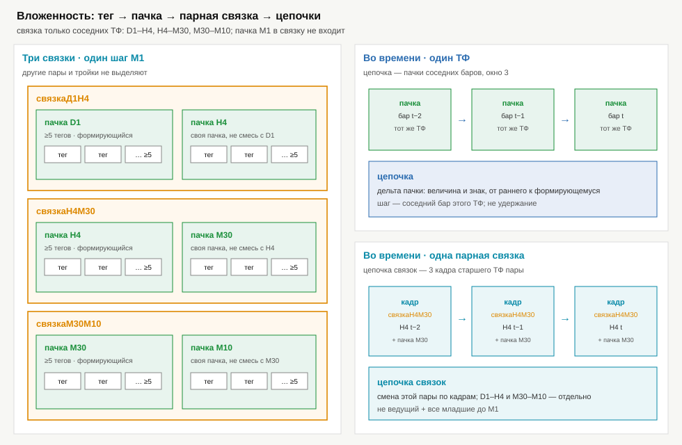
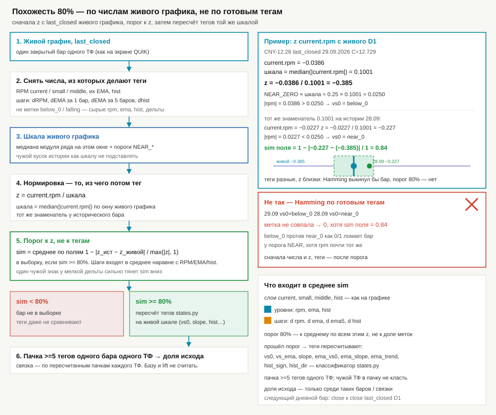

# Теги, пачки, связки, цепочки и цепочка связок



## Тег

**Тег** — дискретная метка **одного** свойства RPM на **формирующемся** баре одного ТФ: слой + поле + одно значение из короткого списка.

Пример: `M1.current.vs0 = above_0` — один тег. Не тег: сырое число RPM (`0.42`), цена, сетап `buy`/`sell` (сетап — комбинация нескольких тегов).

Слои как на графике: `current` (RPM этого ТФ), `small` / `middle` / hist-слой RPM-up. Поля: `vs0`, `vs_ema`, `slope`, `ema_vs0`, `ema_slope`, `ema_trend`, `hist_sign`, `hist_dir`. Значения вроде `above_0`, `below_ema`, `falling_above_ema`, `hist_growing`. Словарь — в [analyzer-marks.md](analyzer-marks.md). Считает `analyzer/states.py`.

Один тег сам по себе не картина и не фильтр.

## Пачка

**Пачка** — набор **не меньше пяти** тегов **одного формирующегося бара одного ТФ**. Дискретность такта — **M1**, и на истории тоже: пачку M5/M10/M20/M30/H4/D1 пересчитывают на каждом M1, не ждут закрытия свечи. **Не одна метка на закрытый M10/M30/H4/D1.** Старший бар на этой минуте **собирают из M1** (OHLC слота на этот момент). Готовый CSV M10/M30/H4/D1 — только сверка на **закрытии** слота, не рабочий ряд. Пачка и сигнал на открытом слоте **моргают** с каждой M1 — ограничение для правок существующих анализаторов/сетей и для новых. Это **не** россыпь тегов с разных ТФ. Полное правило: [tf-from-m1.md](tf-from-m1.md).

Не пачка: один тег, два–четыре тега, теги с разных баров, теги с разных ТФ, один сетап `buy`/`sell`.

Пример (пять тегов одного формирующегося M1): `M1.current.vs0` + `M1.current.vs_ema` + `M1.current.slope` + `M1.small.vs0` + `M1.hist_dir`.

На каждом ТФ у формирующегося бара своя пачка.

Сетапы `*AnalyzerMarks` по-прежнему ставят только на **закрытый** бар; это оверлей входов, не определение пачки.

## Цепочка

**Цепочка** — ряд пачек **одного ТФ** на соседних барах **этого же ТФ**. Шаг задаёт сам ТФ: у M10 только соседний M10 (не M1, не M5, не M20); закрыт бар или формируется — не важно. Окно: **5** соседних баров на каждом ТФ (M1, M5, M10, M20, M30, H4, D1). Идут **от раннего бара окна к формирующемуся**.

Цепочка не пачка и не связка. Удержание (сколько баров «стояла») **не** характеристика цепочки.

### Характеристика цепочки

**Характеристика цепочки** — то, что фиксируют на каждом шаге и по всему окну, чтобы искать похожие паттерны. Это не доля исхода и не Hamming по готовым тегам.

На шаге `t−1 → t` пишут **дельту пачки**: величину и знак изменения (смена).

**Пересечение** — сторона линии относительно EMA или нуля на этом шаге сменилась (после пересчёта тегов на живой шкале). **Направление пересечения** — вверх или вниз. Если сторона не сменилась, пересечения нет. **Флет** — шаг линии меньше порога `NEAR_SLOPE`, не пересечение.

**Приоритет.** Сначала должны сойтись **RPM current** (пересечения, направление пересечений, положение трёх линий, направление/флет) и относительное положение small / middle и их EMA. Величины дельт сравнивают после. Если эти положения и пересечения не совпали в пределах порога, совпадение величин паттерн не засчитывает.

**Порог.** Допустимость совпадения **по всем характеристикам** цепочки — **60%**. Паттерн в выборке при `sim ≥ 60%` по полному набору, не Hamming «16 из 20 тегов». В анализаторе **жёсткий min** — порядок тройки RPM current (`rpm` / ноль / EMA) и пересечения current с нулём и с EMA; **среднее** — порядок small/middle, z-зазоры (в том числе `ema_vs_0`), направление/флет линий, величины, дельта пачки. Направление `current.rpm` само по себе паттерн не отсекает.

**На каждом шаге**

1. **ТФ шага** — тот же, что у цепочки.
2. **Направление** — от более раннего бара к более позднему (к формирующемуся).
3. **RPM current** — очень важные характеристики этого слоя:
   - **пересечение** линии RPM со своей EMA и **направление** пересечения (вверх: с below_ema на above_ema; вниз — наоборот);
   - **пересечение** линии RPM с нулём и **направление** пересечения (вверх через 0 / вниз через 0);
   - **относительное положение трёх линий**: `current.rpm`, ноль, `current.ema` (кто выше кого, включая зону near);
   - **направление и флет** самой линии `current.rpm`: `rising` / `falling` / `flat`.
4. **Относительное положение линий** small / middle и их EMA (кто выше) — тоже приоритет над величинами:
   - `small.rpm` ? `small.ema`
   - `middle.rpm` ? `middle.ema`
   - `small.rpm` ? `middle.rpm`
   - `small.ema` ? `middle.ema`
   - `small.rpm` ? `middle.ema`
   - `middle.rpm` ? `small.ema`
5. **Остальные линии** (small / middle, их EMA, EMA current, hist):
   - **пересечение с нулём** и **направление** этого пересечения;
   - для линий **RPM и EMA** — **направление и флет** (`rising` / `falling` / `flat`).
6. **Дельты чисел** (величина и знак) по всем величинам, которые могут меняться — сравнивают после положений и пересечений:
   - `current.rpm`, `current.ema`
   - `small.rpm`, `small.ema`, `small.hist`
   - `middle.rpm`, `middle.ema`, `middle.hist`
   - hist слоя с `HistDraw` (как на графике)
7. **Смена пачки** — дельта дискретных тегов пачки (≥5) после пересчёта на живой шкале, если набор тегов сдвинулся.

**По всему окну**

8. **Ряд дельт** — все шаги от начала окна до формирующегося бара, без дырок и без чужого ТФ.
9. **Паттерн** — поиск по этому ряду: сначала RPM current и положения линий, затем остальные пересечения/направления, затем величины; порог **60%** по всем характеристикам (см. [похожесть](#похожесть)).

Не цепочка: снимок одного бара; шаг чужого ТФ; прыжок через дырки; смесь тегов с разных ТФ; удержание как счётчик «не менялась N баров».

## Похожая пачка D1 на D1 / H4 / M30

Живой запрос — пачка **формирующегося D1**. Ищут такую же пачку (порядок тройки current, пересечения, слои, величины; без дельты пачки и без цепочки) на истории **D1, H4 и M30** того же инструмента. Префикс ТФ снимают: пачка H4 может быть аналогом пачки D1, это не склейка тегов в одну пачку.

Каждый аналог — основа, от которой смотрят **цену вправо**: первое **закрытое** D1 с датой позже дня аналога (живой формирующийся D1 в исход не кладут). Доли вверх/вниз/флет считают **по каждому ТФ отдельно**, без общей кучи и без базы/lift. Цепочки в этом поиске не участвуют. `--odds` эволюционировал в `--net`, его кадры сюда не подмешивают.

CLI: `python -m analyzer --sec CNY12.26 --pack-ahead`.

## Связка

**Связка** — ровно **две** пачки **одного** инструмента на одном шаге M1. У каждого ТФ — своя формирующаяся пачка ≥5 тегов. Такт — M1 (и на истории тоже).

Выделяют **только** три парные связки:

| имя | пачки | старший пары |
|---|---|---|
| **связкаМ1М10** | M1 + M10 | M10 |
| **связкаМ5М10** | M5 + M10 | M10 |
| **связкаМ10М20** | M10 + M20 | M20 |

Эти три объекта — для **поиска паттернов**, **долей** и **входа обучения сети**. Доли, похожесть, согласованность/противоречие — внутри одной парной связки, не в общей куче. Исход аналога — следующее закрытие **старшего** ТФ пары.

Связка не пачка: в пачку чужой ТФ не кладут.

**Не связка** (не выделять): D1+H4; H4+M30; M30+M10; M1+M5; M5+M20; D1+M30; тройка и пятёрка ТФ; пачки разных инструментов; один ТФ; теги с двух ТФ без двух пачек ≥5.

`--combo` в CLI (дерево состояний H4→M1) — не связка. Вход пачек сети — **связкаМ1М5М10М20** (2 M1 + 2 M5 + 2 M10 + 1 M20). К нему добавляют доли трёх парных связок (по 4 числа: есть связка / вверх / вниз / флет), см. [analyzer-net.md](analyzer-net.md).

## Кадр и цепочка связок

**Кадр паттернов** — срез трёх парных связок на одном шаге M1. У каждой связки в кадре **две цепочки по 5 соседних пачек** её ТФ (от раннего бара окна к формирующемуся на эту минуту). Не четыре ТФ скопом и не «ведущий + младшие до M1».

| связка | в кадре паттернов |
|---|---|
| **связкаМ1М10** | цепочка из 5 пачек M1 + цепочка из 5 пачек M10 |
| **связкаМ5М10** | цепочка из 5 пачек M5 + цепочка из 5 пачек M10 |
| **связкаМ10М20** | цепочка из 5 пачек M10 + цепочка из 5 пачек M20 |

**Кадр сети** — **связкаМ1М5М10М20**: **2** пачки M1 + **2** M5 + **2** M10 + **1** M20 на том же шаге M1, плюс 12 чисел долей аналогов трёх пар (`ok` / вверх / вниз / флет). D1, H4 и M30 на вход MLP не идут. Один прогон, четыре головы ahead (1 / 5 / 10 / 20 M1): пунктир — среднее четырёх; точка только на M10 — голова 10 M1 и вето импульса (`Wa` нет). Как объекты поиска паттернов три парные связки считают **отдельно**; их доли — поля того же вектора. Как именно ставят круг: [analyzer-net.md](analyzer-net.md#точка-обучение-и-живой-график).

`--odds` / `*AnalyzerOdds` эволюционировали в `--net` / `*AnalyzerNet`. Кадр odds (ведущий→M1) — не этот кадр и не развивается.

Не кадр паттернов: четыре ТФ как одна связка; тройка ТФ как парная связка; смесь двух типов пар в одну цепочку. Не путать кадр сети (M1+M5+M10+M20 + доли пар) с одной парной связкой.

## Похожесть

Порог похожести **60%** применяют **не** к уже посчитанным значениям тегов. Сначала берут **числа с живого графика** (формирующийся бар, такт M1), затем **пересчитывают теги**. Для **цепочки** совпадение считают по всем её характеристикам; RPM current (пересечения, три линии, направление/флет) и положения линий приоритетнее величин.



С формирующегося бара живого графика снимают величины слоёв, из которых делают теги: RPM `current` / `small` / `middle`, EMA, hist, шаги. Шкала — медиана модуля **этого** окна (`NEAR_*` в [analyzer-marks.md](analyzer-marks.md)). Исторический бар нормируют тем же знаменателем:

```text
z = число / шкала_живого
sim_поля = 1 − |z_ист − z_живой| / max(|z_ист|, |z_живой|, 1)
sim      = среднее sim_поля по RPM, EMA, hist и шагам
```

В выборку бар или паттерн цепочки попадает при `sim ≥ 60%`. Теги на историческом баре считают заново классификатором `analyzer/states.py` на живой шкале. Пачка после пересчёта по-прежнему ≥5 тегов **одного формирующегося бара одного ТФ**. Связка — только **связкаМ1М10**, **связкаМ5М10** или **связкаМ10М20** по пересчитанным пачкам пары, не смесь тегов и не другие пары ТФ. Цепочка: сначала RPM current и положения линий, потом остальные пересечения и направления, потом величины дельт; порог 60% по всем характеристикам. У пары обе цепочки (по 5 баров) должны пройти порог.

Похожая **пачка** формирующегося D1 ищется на D1, H4 и M30 (последний бар, без цепочки). Исход — закрытие следующего D1 справа от аналога; доли по каждому ТФ отдельно.

Пример, D1 CNY-12.26: `current.rpm = −0.0386`, шкала `median(|current.rpm|) = 0.1001`, **z = −0.0386 / 0.1001 = −0.385**. На соседнем дне тем же знаменателем `z = −0.227`, sim поля `0.84`. Теги `vs0=below_0` против `near_0` при Hamming разошлись бы.

Не похожесть: Hamming по готовым меткам («16 из 20 тегов совпали»). Не подставлять медиану чужого окна истории вместо шкалы живого графика.

## Доля

Исход (вниз / вверх / флет) считают среди случаев, где есть эта **пачка** или эта **парная связка** (связкаМ1М10 / связкаМ5М10 / связкаМ10М20, в том числе после пересчёта тегов по похожести). Три типа связок — три выборки, без склейки. У пары исход — ход к следующему закрытию **старшего** ТФ (M10 у первых двух, M20 у третьей). Для похожей пачки D1 на D1/H4/M30 исход — ход к следующему D1 справа, доли внутри каждого ТФ (это отдельный `--pack-ahead`, не парная связка). По **цепочке** смотрят ряд дельт от раннего бара окна к формирующемуся и паттерны при `sim ≥ 60%` по всем характеристикам (RPM current и положения линий приоритетнее величин). Не долю «по всем барам» и не удержание. Базу и lift не считают. Те же доли трёх пар (норма 0…1) дописывают к вектору `--train-net` / `--net`.

## Не путать

В логе `--watch` «пачка» — очередь грязных тикеров (до 21 с), не пачка тегов.
